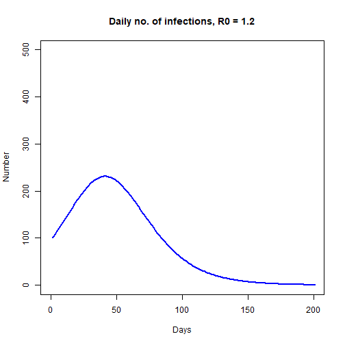

Simple SIR Model and Effects of Intervention
========================================================
author: Yixiang Ng
date: 2 Nov 2021
autosize: true

Introduction
========================================================
The simulation is based on a simple Susceptible-Infectious-Recovered model, or SIR model for short. The rate of change in each compartment (three in total) is governed by the following ordinary differential equations (ODEs):
- dS: -beta * S *  I / N
- dI: beta * S * I / N - gamma * I
- dR: gamma * I
where S, I & R are the number of susceptible, infectious, recovered individuals respectively; N is the total population; beta is the rate of transmission; and gamma is the rate of recovery.

The link to the app is found here: <https://ngyx.shinyapps.io/Simple_SIR_Model/?_ga=2.118158159.791595289.1635817002-597094773.1635385389>.


Parameters
========================================================
There are a few parameters that can be altered with the app.
- The basic reproduction ratio (R0) is the expected number of infections generated by a single case in the early phases of the pandemic and is calculated by beta divided by gamma in this assignment.
- One can also assign initial number of infections to initiate the simulation.
- The number of days to recovery is inversed to calculate the gamma (ie rate of recovery). 
- One can also simulate intervention effects by stating (i) when the intervention starts and (ii) the effects of intervention on the transmission rate beta (an input value of 1 would indicate a 100% reduction in the transmission rate)

Codes
========================================================
The ODEs are solved using the "deSolve" package. The full script can be found on Github.


```r
sir.model.closed <- function (t, x, params) {    
  S <- x[1]                               
  I <- x[2]
  R <- x[3]
  N <- S + I + R
  with(                                   
    as.list(params),                   
    { dS = -beta*S*I/N
      dI = beta*S*I/N - gamma*I
      dR = gamma*I
      dx <- c(dS,dI,dR)                
      list(dx)}
  )
}

library(deSolve)
out = as.data.frame(ode(xstart,times,sir.model.closed,params)) 
```

Plot
===================================================
One can modify the input parameter values to observe the effects of intervention on the spread. Feel free to play around!




References: University of Washington - Summer Institute in Statistics and Modeling in Infectious Diseases.

